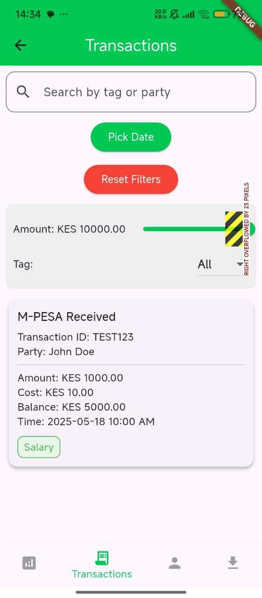
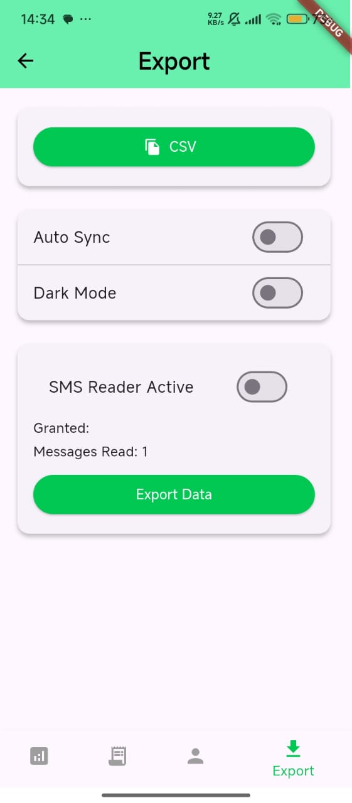
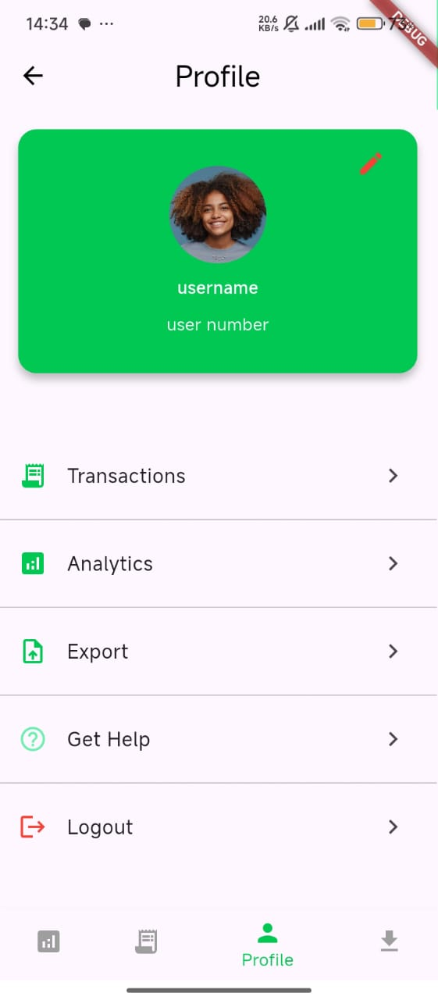
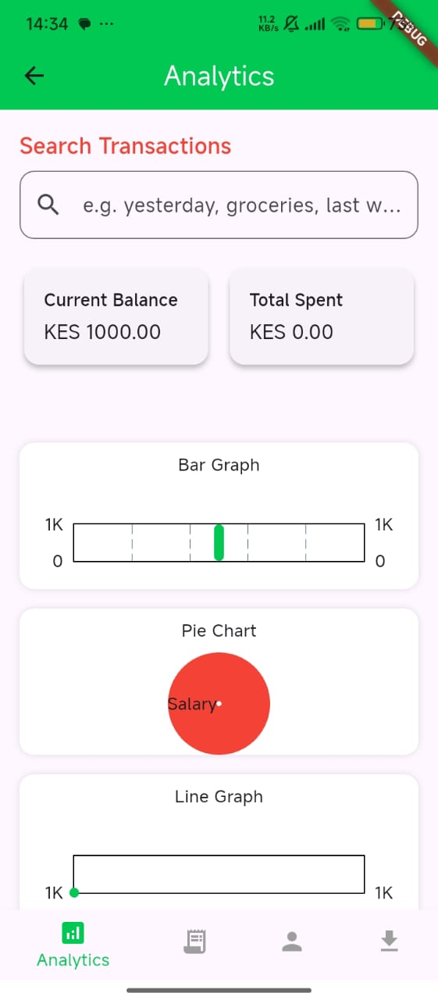

.

# ViewPesa

A new Flutter project.

## Getting Started

This project is a starting point for a Flutter application.

A few resources to get you started if this is your first Flutter project:

- [Lab: Write your first Flutter app](https://docs.flutter.dev/get-started/codelab)
- [Cookbook: Useful Flutter samples](https://docs.flutter.dev/cookbook)

For help getting started with Flutter development, view the
[online documentation](https://docs.flutter.dev/), which offers tutorials,
samples, guidance on mobile development, and a full API reference.

---

# 💸 ViewPesa

**ViewPesa** is a privacy-first Flutter app that helps users manage and analyze their M-Pesa SMS transactions locally. It includes features for editing, searching, tagging, exporting, and viewing analytics — all without requiring internet access.

---

## 📱 Screenshots

Swipe to view different sections of the app (Dark Mode Enabled):

  
  
  
  

---

## 🧭 Navigation

ViewPesa uses a **bottom navigation bar** to easily switch between:

- **Transactions**  
- **Export**  
- **Profile**  
- **Analytics**

---

## 🔐 Authentication

- Secure **Login** and **Registration**
- Passwords are hashed with **bcrypt**
- **Profile page** allows users to update:
  - Display name  
  - Profile picture  

---

## 🧠 Features

- 📥 **Reads SMS** from your device and extracts M-Pesa transactions
- 💳 Transactions displayed as **cards**
- ✏️ Editable transactions
- 🔍 **Search** by:
  - Tags
  - Date range
  - Person (Sender or Receiver)
- 📊 **Analytics page** with:
  - Graphs by tag
  - Filters by time period
- 📤 **Export** transactions as `.csv` files
- 🌓 **Dark mode** and light mode support
- 💾 Data is stored securely using **SQLite** (fully offline)

---

## 🚀 Getting Started (Project Setup)

To run the app locally:

`bash
git clone https://github.com/semedo-nob/viewpesa.git
cd viewpesa
flutter pub get
flutter run
📈 Project Status
🟢 Currently under active development

🔐 Offline-first with privacy in mind

📱 Fully mobile-optimized UI

🎯 Built with production-readiness in mind

💡 Notes
This repo is private

Images are embedded from within the project at lib/assets/*.jpg

Make sure required permissions for reading SMS are granted on Android
